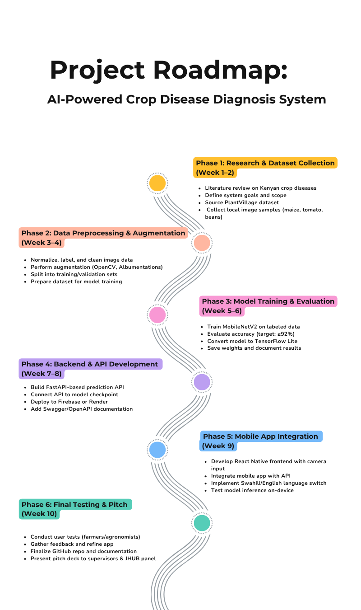

#  CropAI - AI-Powered Crop Disease Diagnosis

[](https://opensource.org/licenses/MIT)
[](https://www.python.org/downloads/)
[](https://fastapi.tiangolo.com)
[](https://tensorflow.org)
[](https://reactnative.dev)
[](https://github.com/Gatmach/cropai/actions)

> Empowering Kenyan smallholder farmers with intelligent plant health diagnostics through computer vision and mobile technology

##  Overview

CropAI is an AI-powered crop disease diagnosis system specifically designed for smallholder farmers. Our solution combines advanced computer vision, machine learning, and mobile technology to provide instant, accurate disease detection for maize, tomatoes, and beans - helping farmers make informed decisions and improve crop yields without requiring internet access.

##  Objectives

- **Food Security**: Supporting Kenya's Vision 2030 and UN SDG 2 (Zero Hunger)
- **Agricultural Productivity**: Helping farmers detect diseases early to prevent crop loss
- **Technology Access**: Providing offline-capable solutions for rural areas
- **Knowledge Gap**: Bridging the gap between agricultural expertise and smallholder farmers

##  Features

###  Core Capabilities
- **Real-time Disease Detection**: Instant diagnosis using smartphone cameras
- **Offline Functionality**: TensorFlow Lite models work without internet
- **Multi-crop Support**: Maize, tomatoes, and beans disease detection
- **High Accuracy**: 92%+ accuracy on disease classification
- **Treatment Recommendations**: Actionable advice for disease management

###  Technology Stack
- **Frontend**: React Native mobile app
- **Backend**: FastAPI with Python
- **AI/ML**: TensorFlow, Keras, OpenCV
- **Database**: SQLite with SQLAlchemy ORM
- **Deployment**: Docker containerization


## Architecture

### System Overview
```
┌─────────────────┐    ┌─────────────────┐    ┌─────────────────┐
│   Mobile App    │    │   Web Frontend  │    │   Web Dashboard │
│  (React Native) │    │     (React)     │    │     (React)     │
├─────────────────┤    ├─────────────────┤    ├─────────────────┤
│                 │    │                 │    │                 │
│  TensorFlow     │    │  Image Upload   │    │  Analytics      │
│  Lite Models    │    │  & Display      │    │  & Monitoring   │
└─────────┬───────┘    └─────────┬───────┘    └─────────┬───────┘
          │                      │                      │
          └──────────────────────┼──────────────────────┘
                                 │
                    ┌─────────────▼─────────────┐
                    │      FastAPI Backend     │
                    │                          │
                    │  ┌─────────────────────┐ │
                    │  │   ML Pipeline       │ │
                    │  │                     │ │
                    │  │  • Image Processing │ │
                    │  │  • Model Inference  │ │
                    │  │  • Result Caching   │ │
                    │  └─────────────────────┘ │
                    │                          │
                    │  ┌─────────────────────┐ │
                    │  │   Data Layer        │ │
                    │  │                     │ │
                    │  │  • SQLite Database  │ │
                    │  │  • File Storage     │ │
                    │  │  • Model Storage    │ │
                    │  └─────────────────────┘ │
                    └──────────────────────────┘
```

##  Contributors

We welcome contributions! Please see our [Contributing Guidelines](CONTRIBUTING.md) for details.

- [Akech Atem](https://github.com/akechsmith)
- [Meshack Otieno Ouma](https://github.com/Meshackoo)
- [Gatmach Yuol Nyuon](https://github.com/Gatmach)
- [Methusella Nyongesa](https://github.com/OfficialMNM)
- [Collins Omollo](https://github.com/loskiii)

##  Roadmap

See our [ROADMAP](docs/Roadmap/ROADMAP.md) for project phases and progress.


##  License

This project is licensed under the MIT License - see the [LICENSE](LICENSE) file for details.
